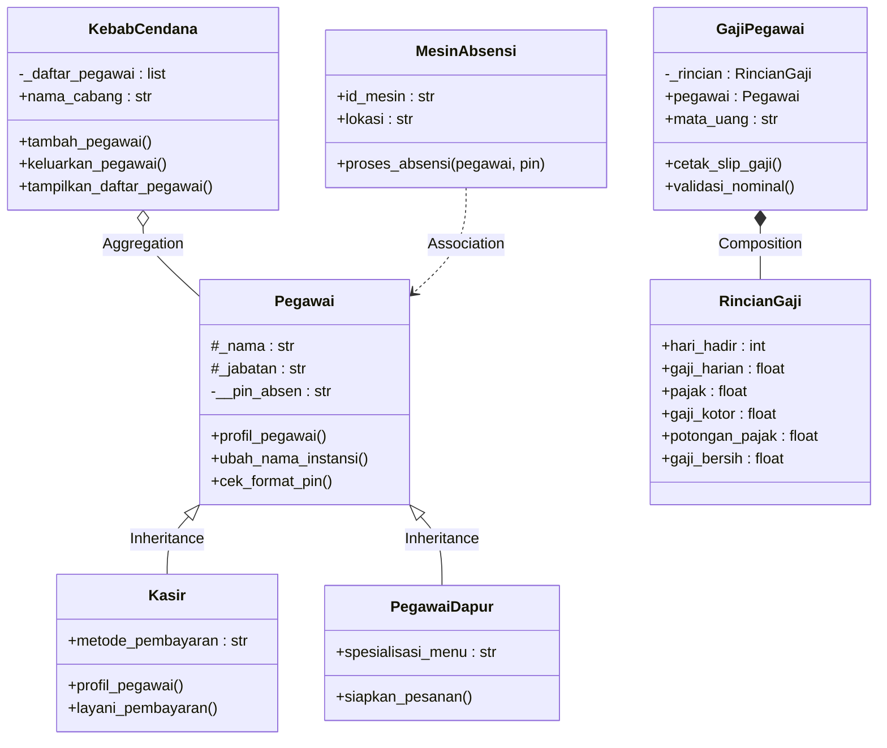

# Posttest 2 PBO - Manajemen Pegawai Kebab Cendana

**Nama:** Antung Hissyam  
**NIM:** 2509106092  
**Kelas:** C1 '25  
**Program Studi:** Informatika  
**Universitas Mulawarman**

---

## 1. Deskripsi

Program ini merupakan lanjutan dari Posttest 1 dengan tema Manajemen Pegawai Kebab Cendana. Pada Posttest 2 ini, program telah diperbarui dengan menerapkan dua pilar Pemrograman Berbasis Objek, yaitu **Relasi UML** dan **Inheritance** (Pewarisan) sesuai dengan syarat penugasan.

Relasi UML yang diterapkan meliputi Asosiasi, Agregasi, dan Komposisi. Sedangkan pada Inheritance, program menggunakan `Pegawai` sebagai Superclass, dengan `Kasir` dan `PegawaiDapur` sebagai Subclass.

## 2. Class yang Digunakan

| Class | Fungsi | 
| :--- | :--- | 
| `Pegawai` | Superclass; menyimpan data dan perilaku dasar pegawai. | 
| `Kasir` | Subclass; merepresentasikan pegawai kasir. | 
| `PegawaiDapur` | Subclass; merepresentasikan pegawai bagian dapur. | 
| `KebabCendana` | Class untuk manajemen cabang dan menampung pegawai. | 
| `MesinAbsensi` | Class untuk memproses absensi pegawai. | 
| `GajiPegawai` | Class untuk mengelola data dan perhitungan akhir gaji. | 
| `RincianGaji` | Class komponen penyusun perhitungan rinci gaji. | 

## 3. Penerapan Relasi UML

Program ini memenuhi syarat penerapan Relasi UML dengan rincian berikut:

### A. Asosiasi
`MesinAbsensi` memiliki hubungan "menggunakan" dengan `Pegawai`. Objek `Pegawai` dikirim sebagai parameter pada method `proses_absensi()` tanpa membuat `Pegawai` menjadi bagian dari `MesinAbsensi`.
```python
def proses_absensi(self, pegawai, pin):
    print(f"Absensi {pegawai.nama} melalui {self.id_mesin}")
```

### B. Agregasi
`KebabCendana` memiliki hubungan "memiliki kumpulan" `Pegawai`. Objek pegawai dibuat di luar `KebabCendana`, kemudian dimasukkan ke dalam `_daftar_pegawai`. Jika objek cabang dihapus, objek pegawai tetap hidup/eksis.
```python
def tambah_pegawai(self, pegawai):
    self._daftar_pegawai.append(pegawai)
```

### C. Komposisi
`GajiPegawai` memiliki hubungan "terdiri dari" yang sangat kuat dengan `RincianGaji`. Objek `RincianGaji` diinstansiasi secara langsung di dalam *constructor* `GajiPegawai` sehingga siklus hidupnya saling terikat.
```python
def __init__(self, pegawai, hari_hadir, gaji_harian, pajak=0.05):
    self._rincian = RincianGaji(hari_hadir, gaji_harian, pajak)
```

## 4. Penerapan Inheritance (Pewarisan)

Program ini memenuhi seluruh poin wajib inheritance:

1. **Superclass & Subclass:** Memiliki 1 Superclass (`Pegawai`) dan 2 Subclass (`Kasir`, `PegawaiDapur`).
2. **Penggunaan `super()`:** Kedua subclass menggunakan `super().__init__(...)` untuk memanggil konstruktor milik parent class guna menginisialisasi atribut dasar.
   ```python
   class Kasir(Pegawai):
       def __init__(self, nama, pin, metode_pembayaran):
           super().__init__(nama, "Kasir", pin)
   ```
3. **Atribut Tambahan Spesifik:**
   * Subclass `Kasir` memiliki atribut tambahan `metode_pembayaran`.
   * Subclass `PegawaiDapur` memiliki atribut tambahan `spesialisasi_menu`.
4. **Method Overriding:** Method `profil_pegawai()` dari superclass di-override pada subclass `Kasir` dengan menambahkan informasi "Metode Pembayaran".
5. **Tingkat Akses (Protected & Private):**
   * **Protected (`_nama`, `_jabatan`):** Digunakan agar data ini dapat diakses langsung oleh subclass (terlihat pada method overridden).
   * **Private (`__pin_absen`):** Digunakan untuk data rahasia PIN, yang hanya bisa dimodifikasi melalui mekanisme *setter* (property) di superclass.

## 5. UML Class Diagram

> **Catatan:** Diagram di bawah ini menggunakan **Mermaid** agar otomatis terender rapi di platform seperti GitHub. 



<details>
<summary><b>Klik di sini jika ingin melihat UML Diagram versi Teks (ASCII)</b></summary>

```text
               ┌──────────────────────────────┐
               │           Pegawai            │
               ├──────────────────────────────┤
               │ # _nama : str                │
               │ # _jabatan : str             │
               │ - __pin_absen : str          │
               ├──────────────────────────────┤
               │ + profil_pegawai()           │
               │ + ubah_nama_instansi()       │
               │ + cek_format_pin()           │
               │ + pin_absen                  │
               └──────────────┬───────────────┘
                              │△
               ┌──────────────┴──────────────┐
               │                             │
┌──────────────┴──────────────┐ ┌────────────┴────────────────┐
│            Kasir            │ │        PegawaiDapur         │
├─────────────────────────────┤ ├─────────────────────────────┤
│ + metode_pembayaran : str   │ │ + spesialisasi_menu : str   │
├─────────────────────────────┤ ├─────────────────────────────┤
│ + profil_pegawai()          │ │ + siapkan_pesanan()         │
│ + layani_pembayaran()       │ └─────────────────────────────┘
└─────────────────────────────┘

┌──────────────────────────────┐
│         KebabCendana         │
├──────────────────────────────┤
│ - _daftar_pegawai : list     │
│ + nama_cabang : str          │
├──────────────────────────────┤
│ + tambah_pegawai()           │
│ + keluarkan_pegawai()        │
│ + tampilkan_daftar_pegawai() │
└──────────────┬───────────────┘
               │◇ 0..*
               ▼
┌──────────────────────────────┐
│           Pegawai            │
└──────────────────────────────┘

┌──────────────────────────────┐
│         MesinAbsensi         │
├──────────────────────────────┤
│ + id_mesin : str             │
│ + lokasi : str               │
├──────────────────────────────┤
│ + proses_absensi()           │
└──────────────┬───────────────┘
               │
               - - - - - - - - - - >  Pegawai (Asosiasi)

┌──────────────────────────────┐
│         GajiPegawai          │
├──────────────────────────────┤
│ - _rincian : RincianGaji     │
│ + pegawai : Pegawai          │
│ + mata_uang : str            │
├──────────────────────────────┤
│ + cetak_slip_gaji()          │
│ + validasi_nominal()         │
└──────────────┬───────────────┘
               │◆ 1
               ▼
┌──────────────────────────────┐
│         RincianGaji          │
├──────────────────────────────┤
│ + hari_hadir : int           │
│ + gaji_harian : float        │
│ + pajak : float              │
│ + gaji_kotor : float         │
│ + potongan_pajak : float     │
│ + gaji_bersih : float        │
└──────────────────────────────┘
```
</details>

## 6. Hasil Run

```text
Kebab Cendana
Pegawai: Antung | Jabatan: Kasir | Metode: Cash / QRIS
Pegawai: Dita | Jabatan: Dapur
Total pegawai: 2
Antung ditambahkan ke Kebab Cendana Pusat
Dita ditambahkan ke Kebab Cendana Pusat
Daftar pegawai Kebab Cendana Pusat
- Antung | Kasir
- Dita | Dapur
Total: 2
Absensi Antung melalui ABS-01
Absensi berhasil
Absensi Dita melalui ABS-01
PIN salah
Gaji Antung (20 hari): IDR 1900000
Gaji Dita (15 hari): IDR 1710000
Total pengeluaran gaji: IDR 3610000
Data pegawai setelah cabang dihapus:
Antung masih ada
Dita masih ada
Kasir Antung menerima pembayaran Rp50,000
Dapur Dita menyiapkan Kebab Spesial (Kebab Original)
isinstance(pegawai1, Pegawai): True
issubclass(Kasir, Pegawai): True
Validasi PIN: PIN harus berupa angka dan minimal 4 digit
```

## 7. Kesimpulan

Program Sistem Manajemen Kebab Cendana telah mengimplementasikan konsep Relasi UML (Asosiasi, Agregasi, Komposisi) serta Inheritance (Pewarisan, Superclass/Subclass, Override, `super()`, dan enkapsulasi Protected/Private). Keseluruhan logika berhasil berjalan sesuai dengan materi Posttest 2 PBO.